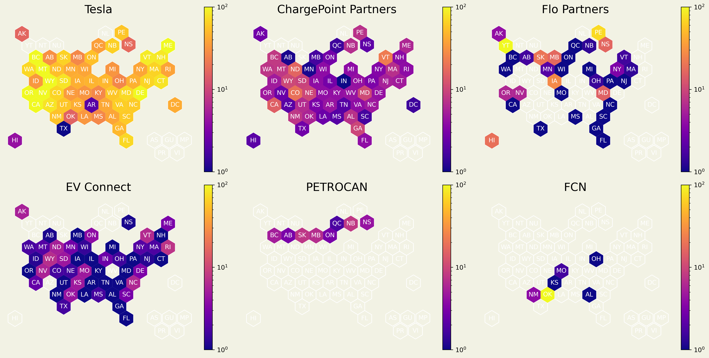

# Charging Networks

Exploring the ever changing world of public fast charging stations! Check out my blog, [The Power Supply](<powersupply.substack.com/p/fast-charging-networks>, for a better picture.

As of 2023-07-29 01:30:29 the United States and Canada have installed 36,854 fast charging stations.1 As the name suggests, fast chargers are the only practical way to fill-up on longer trips, so understanding them is important to decarbonize travel beyond your daily commute. About 95 percent of fast chargers do not accept credit, debit or cash, relying instead on charging networks.

Tesla is a dominant network in this space, and currently exclusive to Tesla vehicles. With that said, some major auto manufacturers have begun signing deals to gain access to this rebust network. Ford, one such company, is anticipated to release a NACS - CCS adaptor imminently in 2024.

Some of these charger providers have signed agreements with one another to allow reciprosity or access using the same App. This below map considers the availability of DCFC by region when accounting for different partnering networks.

Finally, I've compiled a map that considers where DCFC are located with geographic hexagonal state-province features for all charger networks, unaggregated by partner. This gives a sense for the leaders in the space as well as their geographic focus.

